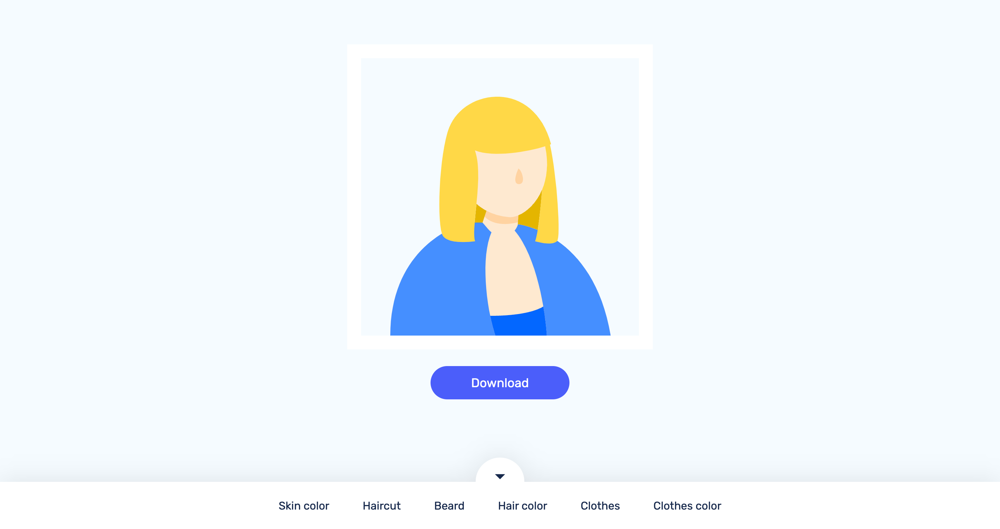

<h1 align="center">Shine Avatar Generator</h1>



## Installation guide
### Install the dependencies

```bash
yarn install
```
### Run the app

```bash
yarn start
```

Runs the app in the development mode. Open [http://localhost:3000](http://localhost:3000) to view it in the browser.
